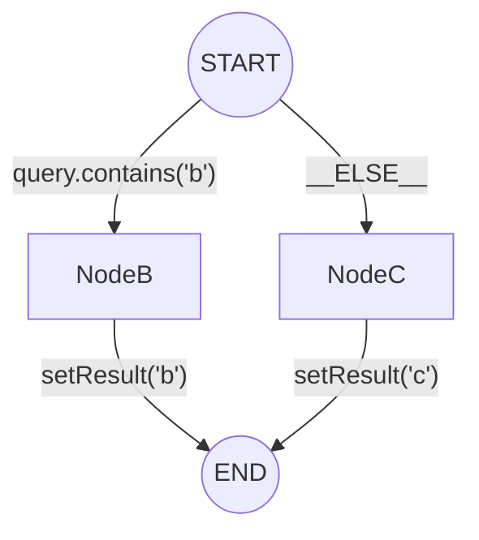

# saa-graph-composer

通过 **saa-graph-composer**，我们可以简化复杂的 Agent 编排。

## ✨ 功能特性

### 1. 声明式开发 (What You Write)

**开发者只需要关注业务逻辑**。通过 `@GraphComposer` 定义蓝图，清晰直观。

```java
@GraphComposer(id = "routed_graph_composer", targetBeanName = "routedGraphCompiled")
public class RoutedGraphComposer {

    @GraphKey
    public static final String KEY_QUERY = "query";

    @GraphKey
    public static final String KEY_RESULT = "result";

    // avoid using magic values
    private static final String NODE_B = "nodeB";
    private static final String NODE_C = "nodeC";

    @ConditionalEdge(source = StateGraph.START, mappings = {"b", NODE_B, "c", NODE_C})
    public String route(OverAllState state) {
        String query = state.value(KEY_QUERY).orElseThrow().toString();
        return query.contains("b") ? "b" : "c";
    }

    @GraphNode(id = NODE_B, next = StateGraph.END)
    final AsyncNodeAction nodeB = state -> CompletableFuture.completedFuture(Map.of(KEY_RESULT, "b"));

    @GraphNode(id = NODE_C, next = StateGraph.END)
    final AsyncNodeAction nodeC = state -> CompletableFuture.completedFuture(Map.of(KEY_RESULT, "c"));

}
```

### 2. 逻辑可视化 (What You Think)

**对应的业务拓扑结构**。上述代码对应以下 Mermaid 流程图。



### 3. 等效代码 (What You Saved)

**这是你不必写的代码**。如果不使用本库，要在原生 Spring AI Alibaba Graph 中实现相同功能，你需要手动编写以下所有代码：

```java
@Configuration
public class ManualGraphConfiguration {

    @Bean("routedGraphCompiled")
    public CompiledGraph buildRoutedGraph() throws GraphStateException {
        StateGraph builder = new StateGraph(() -> Map.of(
                "query", new ReplaceStrategy(),
                "result", new ReplaceStrategy()
        ));

        AsyncNodeAction nodeBAction = state -> 
            CompletableFuture.completedFuture(Map.of("result", "b"));
            
        AsyncNodeAction nodeCAction = state -> 
            CompletableFuture.completedFuture(Map.of("result", "c"));

        builder.addNode("nodeB", nodeBAction);
        builder.addNode("nodeC", nodeCAction);

        builder.addEdge("nodeB", StateGraph.END);
        builder.addEdge("nodeC", StateGraph.END);

        AsyncEdgeAction condition = state -> {
            String query = (String) state.value("query").orElseThrow();
            String routeKey = query.contains("b") ? "b" : "c";
            return CompletableFuture.completedFuture(routeKey);
        };

        Map<String, String> routeMapping = Map.of(
                "b", "nodeB",
                "c", "nodeC"
        );

        builder.addConditionalEdges(StateGraph.START, condition, routeMapping);

        return builder.compile();
    }
}
```
