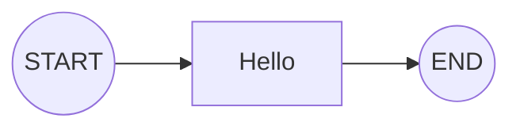

# SAA Graph Composer

[](https://codecov.io/github/chrisis58/saa-graph-composer) [](LICENSE)

Spring AI Alibaba Graph 的声明式编排扩展。

[📚 在线文档](https://chrisis58.github.io/saa-graph-composer/) | [🚀 快速开始](https://chrisis58.github.io/saa-graph-composer/guide/getting-started.html)

## ✨ 核心特性

* 🔌 节点即适配器 (Node as Adaptor)
  将 Composer 作为纯粹的路由层，编排逻辑与业务实现自然解耦。
* 🧩 代码即图表 (Code as Graph)
  所见即所得的开发体验，像阅读流程图一样阅读代码。
* 🍃 非侵入式原生扩展
  基于 Spring 标准生命周期构建，完全兼容官方 API，无缝共存。

通过 `@GraphComposer` 定义蓝图，告别繁琐的手动构建：

```java
@GraphComposer
public class HelloGraphComposer {

    @GraphKey
    public static final String KEY_GREETING = "greeting";

    @GraphNode(id = "hello", isStart = true, next = StateGraph.END)
    final NodeAction helloAction = state -> 
        	Map.of(KEY_GREETING, "Hello, Graph Composer!");
}
```

对应生成的拓扑结构：



## 📦 安装与使用

👉 **[查看详细安装指南](https://chrisis58.github.io/saa-graph-composer/guide/getting-started.html)**

---

<div align=center> 
💬任何使用中遇到的问题、希望添加的功能，都欢迎提交 issue 交流！<br />
⭐ 如果这个项目对你有帮助，请给它一个星标！<br /> <br /> 
</div>